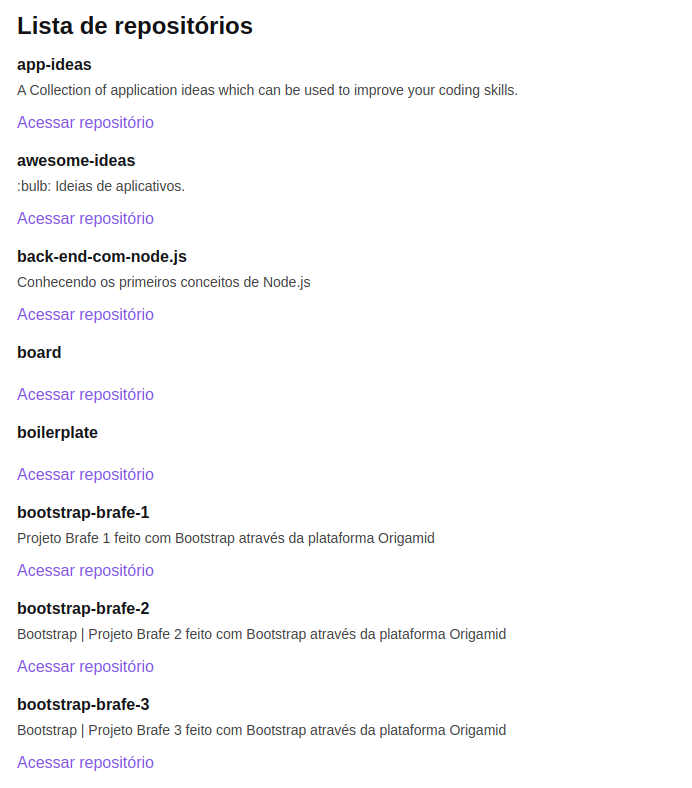

<h4 align="center">
  
</h4>

 

    <!-- LICENSE -->
    
    <!-- LAST COMMIT -->
    
    <!-- STARS -->
    
    <!-- FORKS -->
    
    <!-- AUTHOR -->
    
    <!-- LANGUAGES -->
    
    <!-- REPO SIZE -->
    
    <!-- CONTRIBUTORS -->
  

<h1 align="center">
Github Explorer - Ignite - Trilha React.js
</h1>

Deployed <a href="https://ignite-reactjs-github-explorer.vercel.app/">here</a>.

<h2 id="-computer-about">:computer: About</h2>

Github Explorer is a web application that lists all user repositories. project developed in the first chapter of Bootcamp Ignite - React.js

<h2 id="-what-is-the-ignite-https-rocketseat-com-br-ignite-">🚀 What is the <a href="https://rocketseat.com.br/ignite">Ignite</a>?</h2>

Program to accelerate your career as a Dev..
Created to prepare you for the market, developing technical and behavioral skills. Evolve and certify in Elixir, Flutter, React.js or React Native.

<!-- 
#### 📋 Functionalities

- [x] Sessão de home
- [x] Sessão sobre
- [x] Sessão de serviços
- [x] Sessão de depoimentos
- [x] Sessão de contacto
- [x] Botão de agendamento para o WhatsApp.
- [x] Ícones das redes sociais.

--- -->

<!-- #### 🎨 Layout

O layout da aplicação está disponível no Figma:

Design feito por [Rebecca Gonzalez](https://dribbble.com/rebeccagonzalez)

--- -->
<h2 id="-computer-web-mobile">:computer:  Web/mobile</h2>
<h4 align="center">
  
</h4>

<!-- #### 📱 Mobile

<h4 align="center">
  
  
Tela inicial - OriginSix

</h4>
--- -->
<!-- #### :crossed_swords: Desafios para melhorar a aplicação
- [ ] Criar documentação
    - [ ] Gif de exemplo
    - [x] Readme-me incrível
    - [x] Tecnologias usadas
    - [x] Setup do projeto
    - [x] Funcionalidades
    - [ ] Screenshot das páginas
    - [ ] Adicionar favicon
 - [ ] Melhorar estilos
    - [ ] breakpoints - adaptar para outros dispositivos
    - [ ] Mobile First
    - [ ] Trocar cores, fontes e conteúdo
 -->
 <!--==================== TECH STACK  ====================-->

<section id="-rocket-tech-stack">
  <h2>🚀 Tech Stack</h2>
  
The following tools were used in the construction of the project:

  <ul>
    <li><strong><a href="https://pt-br.reactjs.org/">React</a></strong></li>
    <li><strong><a href="https://www.typescriptlang.org/">TypeScript</a></strong></li>
    <li><strong><a href="https://styled-components.com/">Styled-Components</a></strong></li>
  </ul>

  

  <h2 id="-how-to-run-the-project">🚀 How to run the project</h2>
  <h3 id="prerequisites">Prerequisites</h3>
  
Have an editor to work with the code like 
    <a href="https://code.visualstudio.com/">VSCode</a>
  

</section>
<!--==================== CLONING THE REPOSITORY ====================-->

<section id="-cloning-the-repository">
  <h2>👯 Cloning the repository</h2>
  <pre><code class="lang-bash"># Clone this repository
  $ git clone https://github.com/marcelo-rafael/ignite-reacts-github-explorer

# Access the project folder in the terminal/cmd
$ cd oignite-reacts-github-explorer
</code></pre>

  <h3 id="running-the-application">Running the Application</h3>
  <pre><code class="lang-bash"># install dependencies
  $ yarn or npm install

# Run Application in Development
$ yarn dev or npm run start

# The application will open at port: 8080 - access http://localhost:3000
</code></pre>

</section>
<!--==================== COMMANDS ====================-->

<section id="-commands">
  <h2>🔎 Commands</h2>
  <ul>
    <li><code>dev</code>: runs your application on <code>localhost:8080</code></li>
    <li><code>build</code>: creates the production build version</li>
  </ul>
</section>
<!--==================== CONTRIBUTE TO THE PROJECT ====================-->

<section id="-how-to-contribute-to-the-project"">
  <h2>💪 How to contribute to the project</h2>
  <ol>
    <li>🍴 Fork the project.</li>
    <li>👯 Clone this repository to your machine.</li>
    <li>🎋 Create a new branch with your changes: <code>git checkout -b my-feature</code></li>
    <li>✅ Save the changes and create a commit message telling you what you've done: <code>git commit -m "feature: My new feature"</code></li>
    <li>📌 Submit your changes: <code>git push origin my-feature</code></li>
    <li>🔃 Create a new pull request</li>
  </ol>
  
Once your pull request has been merged, you can delete <code>your-feature</code>

  <blockquote>
    
If you have any questions, check out this 
      <a href="https://github.com/firstcontributions/first-contributions">GitHub      Contribution Guide
      </a>
    

  </blockquote>
</section>
<!--==================== AUTHOR ====================-->

<section id="-autor">
  <h2>🤓 Author</h2>
  

    
  

  

    
    
    

</section>

<!--==================== LICENSE ====================-->

<section id="-license">
  <h2>📝 LICENSE</h2>
  
This repository is licensed under the <strong>MIT LICENSE</strong>. For more detailed information, read the <a href="./LICENSE">LICENSE</a> file contained in this repository.

  <h3 align="center">
  Made with ❤️ by <a href="https://www.linkedin.com/in/marcelo-rafael-goncalves/">Marcelo Rafael Gonçalves 💜🚀</a>
  </h3>
</section>
